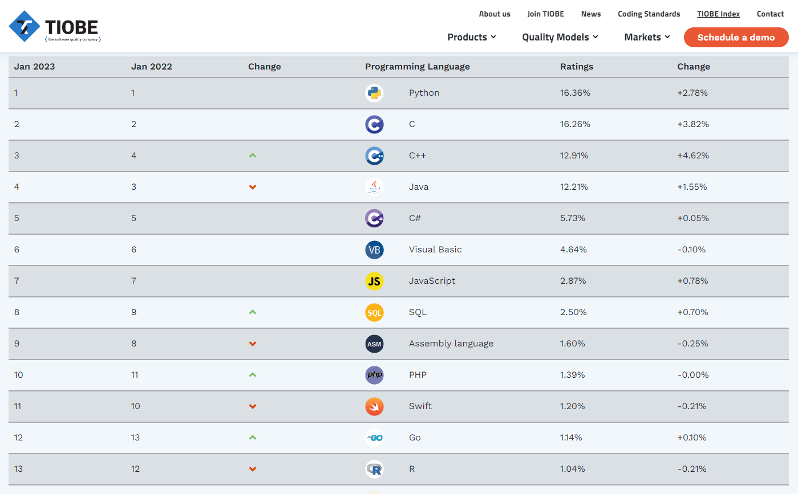

# Python

1991년 귀도 반 로섬이 만든 프로그래밍 언어

웹사이트, 소프트웨어, 업무 자동화, 데이터 분석, 데이터 시각화 등 다양한 용도로 사용됨

 

## Why Python ?
-----
1. 2023년 1월 기준 가장 인기 있는 프로그래밍 언어

https://www.tiobe.com/tiobe-index/
2. 쉬운 syntax
3. 강력한 커뮤니티 
4. 다양한 라이브러리와 프레임워크
5. 웹개발부터 빅데이터 및 머신러닝까지에도 활용가능

   - Tensorflow (Data Flow Graph 구조를 사용하는 프레임워크)
   - Keras (파이썬으로 작성된 오픈 소스 신경망 라이브러리)
   - Numpy(수치 데이터)
   - [pandas]("https://wikidocs.net/32829") (데이터 분석)
   - Matplotlib (데이터 시각화)

 

## 파이썬의 특징
-----
✓ 인터프리터 언어처럼 동작 => 코드를 작성하고 바로 실행 가능

✓ 코멘드의 마지막을 표기하기 위해 세미콜론이나 괄호 등을 사용하지 X

✓ 들여쓰기를 사용해 블록을 구분하기 때문에 포맷팅에 주의! 

 

## 파이썬 문법
-----
다음시간에....
